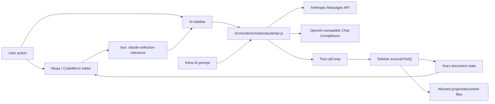

# AI Implementation

本文档说明 MarkText 当前 AI 功能的实现方式、运行链路和关键设计约束。这里的 AI 功能主要包括右侧栏文档聊天、选区 Ask/Rewrite、AI 工具调用、会话持久化和 AI 驱动的 Markdown 编辑。

## 功能范围

当前实现位于 renderer 侧，主要文件如下：

- `src/renderer/node/claudeApi.js`：统一的 AI Provider 调用层，负责 Anthropic Messages API 与 OpenAI Chat Completions 兼容接口的请求、SSE 流解析、工具调用循环和消息格式转换。
- `src/renderer/components/sideBar/claudeChat.vue`：右侧栏 AI 聊天 UI，负责配置、会话、上下文引用、工具执行、编辑确认、渲染回复和错误重试。
- `src/renderer/components/editorWithTabs/inlineAiPrompt.vue`：编辑器选区上的内联 AI 浮层，提供 Ask 与 Rewrite 两种轻量交互。
- `src/renderer/components/editorWithTabs/editor.vue`：Muya 编辑器与 AI UI 的桥接层，负责选区提取、内联 AI 触发、AI 编辑回写和侧栏引用同步。
- `src/renderer/components/editorWithTabs/sourceCode.vue`：CodeMirror 源码模式下的选区引用与 AI 编辑回写。
- `src/muya/lib/ui/formatPicker/index.js`、`src/muya/lib/ui/formatPicker/config.js`：格式浮层中的 Ask AI 入口。
- `src/renderer/components/sideBar/index.vue`、`src/renderer/components/sideBar/help.js`：右侧栏 AI 面板的注册和展示。

AI 功能没有放在 Electron main process 中。网络请求、localStorage 配置读取、文档上下文读取和文件工具访问都发生在 renderer 进程中。

## 总体架构



架构上分为三层：

1. UI 层：侧栏聊天和内联浮层收集用户输入、显示流式回复、展示 diff 或状态。
2. 模型调用层：`claudeApi.js` 屏蔽 Anthropic 与 OpenAI 兼容接口差异，对外暴露 `streamChat(options)`。
3. 工具执行层：侧栏组件实现 `executeTool(name, input)`，让模型可以读取当前文档、提出编辑、读取项目内文件或列目录。

## Provider 与配置

Provider 常量定义在 `claudeApi.js`：

- `anthropic`：默认 Provider，默认 Base URL 为 `https://api.anthropic.com`，默认模型为 `claude-sonnet-4-5-20250929`。
- `openai`：OpenAI Chat Completions 兼容 Provider，默认 Base URL 为 `https://api.openai.com`，默认模型为 `gpt-4.1`。

配置优先级为：

1. 用户在侧栏设置面板填写的值，持久化到 localStorage。
2. 环境变量。
3. 代码内默认值。

相关 localStorage key：

- `marktext.claudeProvider`
- `marktext.claudeApiKey`
- `marktext.claudeBaseUrl`
- `marktext.claudeModel`
- `marktext.claudePersona`
- `marktext.claudeEditMode`
- `marktext.claudeSessions`
- `marktext.claudeActiveSessionId`
- `marktext.claudeActiveSessionIds`

相关环境变量：

- Anthropic：`ANTHROPIC_API_KEY`、`ANTHROPIC_AUTH_TOKEN`、`ANTHROPIC_BASE_URL`、`ANTHROPIC_MODEL`
- OpenAI 兼容：`OPENAI_API_KEY`、`OPENAI_AUTH_TOKEN`、`OPENAI_BASE_URL`、`OPENAI_MODEL`

OpenAI 兼容 Provider 允许空 API Key，主要用于本地兼容端点。Anthropic Provider 必须有 API Key。

## 调用层原理

`streamChat(options)` 是 AI 调用层的统一入口。它会先通过 `normalizeProvider()` 判断 Provider，再分别进入：

- `streamAnthropicChat(options)`
- `streamOpenAiChat(options)`

两条链路都会执行相同的高层流程：

1. 清洗传入消息：`sanitizeMessages()` 过滤非法 block，保留 text、image、tool_use、tool_result。
2. 发送流式请求：Anthropic 调 `/v1/messages`，OpenAI 兼容调 `/v1/chat/completions`。
3. 解析 SSE：`parseSseStream(response)` 从 `response.body.getReader()` 读取字节流，按空行切分 event，解析 `data:` JSON。
4. 对外 yield 统一事件：
   - `text`：模型输出的文本增量。
   - `tool_start`：模型开始请求某个工具。
   - `tool_end`：工具执行完成。
   - `done`：本轮对话完成，并返回更新后的消息数组。
5. 如果模型请求工具，调用外部传入的 `executeTool()`，将工具结果追加回消息，然后继续下一轮模型请求，直到没有工具调用为止。

Anthropic 和 OpenAI 的工具格式不同，所以 `claudeApi.js` 内部做了适配：

- Anthropic 使用 content block：`tool_use` / `tool_result`。
- OpenAI 使用 `tools`、`tool_calls` 和 `role: "tool"` 消息。

`toOpenAiTools()` 会把统一的 `TOOLS` schema 转换成 OpenAI function tool。`toOpenAiMessages()` 会把内部消息结构转换成 Chat Completions 消息结构，包括图片 block 转 `image_url`。

## System Prompt 与 Persona

基础 system prompt 定义在 `claudeApi.js`，核心约束是：

- AI 是嵌入 MarkText 的 Markdown 助手。
- 用户提到当前文档时应调用 `get_document`。
- 小范围编辑优先用 `replace_text` 或 `insert_text`。
- 只有在能提供完整 Markdown 时才用 `apply_edit`。
- 回复使用与用户相同的语言，并用 GitHub Flavored Markdown 格式。

侧栏设置中的 Writing style 会作为 persona 注入到 system prompt 尾部：

```text
## Writing style preferences
...
```

这意味着 persona 对聊天、工具编辑、内联 Ask/Rewrite 都会生效。

## 工具调用

统一工具 schema 定义在 `claudeApi.js` 的 `TOOLS` 中，目前包含：

- `get_document_outline`：读取当前文档标题大纲，适合先定位长文档结构。
- `get_document_section`：按标题或大纲序号读取当前文档的某个章节。
- `search_document`：在当前文档中搜索关键词并返回上下文片段。
- `get_document`：读取当前打开 Markdown 文档全文。
- `apply_edit`：用完整 Markdown 替换当前文档。
- `replace_text`：精确替换当前文档中的文本。
- `insert_text`：在文档开头、结尾或锚点前后插入文本。
- `read_file`：读取当前项目或当前文档目录内的文件。
- `list_directory`：列出当前项目或当前文档目录内的目录项。
- `glob_files`：按 glob 模式发现当前项目或当前文档目录内的文件。
- `grep_files`：在当前项目或当前文档目录内按正则搜索文件内容。
- `fetch_url`：访问外部 `http/https` URL，返回状态、最终 URL、Content-Type 和截断后的文本内容。

工具真正执行在 `claudeChat.vue` 的 `executeTool()` 中。这样模型调用层不直接依赖 Vuex、当前文件、文件系统权限和编辑确认 UI。

工具执行有几个重要边界：

- `get_document` 从 `currentFile.markdown` 读取，不直接读磁盘，因此总是使用编辑器内最新状态。
- `get_document_outline`、`get_document_section` 和 `search_document` 只读取当前编辑器内存中的 Markdown，用于减少长文档上下文传输。
- `read_file` 和 `list_directory` 要求绝对路径，并且必须位于当前项目目录或当前 Markdown 文件所在目录内。
- `glob_files` 和 `grep_files` 默认从项目根目录搜索；如果传入绝对路径，也必须通过同样的项目/文档目录限制。
- `fetch_url` 只允许外部 `http/https` URL，拒绝 localhost、私有网段、本地文件协议和包含用户名/密码的 URL。
- 文件读取最大 1 MB，目录列表最多 500 项。
- 同一 turn 中如果文档没有变化，重复 `get_document` 会返回缓存提示，避免反复传输全文。

## 文档编辑流程

AI 编辑工具不会直接让模型修改 DOM。所有编辑都先转换成新的 Markdown 字符串，再同步到 Vuex 和编辑器。

侧栏编辑流程：

1. 模型请求 `apply_edit`、`replace_text` 或 `insert_text`。
2. `buildEditProposal()` 基于当前 `currentFile.markdown` 构造 `newMarkdown`。
3. 根据编辑模式决定如何处理：
   - Ask before edits：调用 `requestEditApproval()`，展示 diff，用户点击 Accept 后才应用。
   - Edit automatically：调用 `applyEditImmediately()`，直接应用。
   - Plan mode：拒绝编辑工具，提示模型先给计划。
4. `applyMarkdownUpdate()` dispatch `LISTEN_FOR_CONTENT_CHANGE` 更新 Vuex 文档状态，并通过 `bus.$emit('claude-apply-edit')` 通知 Muya/CodeMirror 重设编辑器内容。

Muya 模式下，`editor.vue` 监听 `claude-apply-edit` 后调用 `editor.setMarkdown(markdown)`。源码模式下，`sourceCode.vue` 监听同一事件后调用 CodeMirror 的 `setValue(markdown)`，并更新 `lastCommittedMarkdown`。

diff 预览由 `computeLineDiff()` 生成。为了避免大文档 diff 过慢，当新旧文本行数乘积超过阈值时会降级为摘要 diff。普通 diff 会折叠大段未变化上下文。

## 内联 AI 流程

内联 AI 是面向选区的轻量入口，主要由 `inlineAiPrompt.vue` 实现。

触发方式：

- 快捷键：`Command/Ctrl + Alt + K`。
- Muya 格式浮层中的 `AI` 按钮。

触发链路：

1. `editor.vue` 捕获快捷键，或 `formatPicker` dispatch `muya-inline-ai`。
2. `triggerInlineAi()` 尝试从 Muya `contentState.getClipBoardData()` 或浏览器 Selection 中提取选区文本和浮层定位 rect。
3. `inlineAiPrompt.open()` 展示浮层。
4. 用户选择 Ask 或 Rewrite 后，组件调用 `streamChat()`。
5. 内联场景传入的 `executeTool` 固定返回 “Tools are disabled for inline edits.”，即内联 AI 不允许读文档工具和文件工具。
6. Ask 模式只展示答案并支持复制；Rewrite 模式流式生成改写文本，用户 Accept 后由 `editor.vue` 将原选区替换为改写结果。

内联 Rewrite 当前使用 `markdown.indexOf(selectionText)` 定位原选区。如果找不到精确文本，会把改写结果复制到剪贴板并给出通知。这意味着同一选区文本在文档中多次出现时，当前逻辑会替换第一个匹配项；后续可以通过保存 Muya selection range 或 block key 来提高定位精度。

## 选区上下文与侧栏联动

编辑器和侧栏通过 `src/renderer/bus` 解耦：

- `claude-selection-reference`：编辑器把当前选区作为侧栏上下文引用。
- `claude-preserve-selection`：侧栏鼠标交互时请求编辑器保留选区高亮。
- `claude-apply-edit`：侧栏应用 AI 编辑后通知编辑器刷新内容。
- `cm-ask-claude`：源码模式相关入口转发到侧栏 Ask。

Muya 模式下，`editor.vue` 在 `selectionChange` 和 `selectionFormats` 中使用 `requestAnimationFrame` 合并频繁事件，避免每次光标变化都立刻更新侧栏。源码模式下，`sourceCode.vue` 在 CodeMirror `cursorActivity` 中节流发布选区引用。

侧栏收到选区引用后，会在用户提问时把它包装为：

```text
<selected_reference>
...
</selected_reference>
```

并附加到用户问题前。快捷模板会显式要求模型调用 `get_document` 读取全文。

## 附加上下文与图片

侧栏输入框支持两类附加上下文：

- `#` 文件引用：从当前项目目录扫描 Markdown / text 文件，选择后将文件内容包装为 `<attached_file>`。
- `@` 标题引用：从当前文档标题中选择一个章节，选择后将该章节包装为 `<attached_section>`。

侧栏还支持粘贴或拖入图片，最多 4 张。图片会被 FileReader 转成 base64 block，再交给 `streamChat()`。Anthropic 直接使用 image content block，OpenAI 兼容链路会转换成 `image_url` data URL。

## 会话与上下文压缩

侧栏会话按当前文档隔离。`getSessionDocumentKey()` 的优先级是：

1. 已保存文件：`file:<pathname>`
2. 未保存草稿：`draft:<id>`
3. 项目目录：`project:<pathname>`
4. 兜底：`global`

每个文档最多保留 40 个会话，存储在 localStorage 的 `marktext.claudeSessions` 中。展示消息 `displayMessages` 与发送给模型的 `apiMessages` 分开保存：

- `displayMessages` 面向 UI，包含文本、工具状态、系统提示等。
- `apiMessages` 面向模型，保留 provider 可转换的消息结构。

当估算 token 超过阈值时，侧栏显示压缩入口。`compactConversation()` 会请求模型用 3 到 4 段总结历史，然后用摘要替换 `apiMessages`，但保留 UI 中的完整历史显示。

## 安全与隐私边界

当前实现有几个需要开发者明确了解的边界：

- API Key 存在 localStorage 中，不是系统级安全存储。任何能执行 renderer 代码的逻辑都可能读取这些值。
- Anthropic 请求带有 `anthropic-dangerous-direct-browser-access: true`，表示当前是 renderer 直接访问 API。
- `claudeChat.vue` 使用 Node `fs` 读取文件，因此必须保持 `assertPathAllowed()` 的路径约束。
- AI 编辑先生成 proposal，再通过统一的 Markdown 更新通道落到编辑器，避免模型直接操作 DOM。
- 聊天回复用 `marked` 转 HTML 后通过 `DOMPurify.sanitize()` 清洗，再插入 UI。
- 内联 AI 禁用工具调用，降低选区浮层误读文件或改文档的风险。

如果后续要提升安全性，优先考虑：

1. 将 Provider 请求代理到 main process 或后端服务。
2. 使用系统 keychain 保存 API Key。
3. 给文件工具增加更细的用户确认或目录授权 UI。
4. 给自动编辑模式增加可撤销事务和精确 range 定位。

## 扩展方式

新增 Provider 时，建议只改 `claudeApi.js`：

1. 在 `PROVIDERS`、`DEFAULT_BASE_URLS`、`DEFAULT_MODELS` 中注册 Provider。
2. 实现对应的 `callXxxApi()` 与 `streamXxxChat()`。
3. 将 provider 私有消息格式转换到现有统一事件：`text`、`tool_start`、`tool_end`、`done`。
4. 尽量复用 `TOOLS`、`sanitizeMessages()` 和 `executeToolUse()`，保持 UI 层不感知 Provider 差异。

新增工具时，需要同时更新：

1. `claudeApi.js` 的 `TOOLS` schema。
2. `claudeChat.vue` 的 `TOOL_LABELS`。
3. `claudeChat.vue` 的 `executeTool()` 分支。
4. 如果工具会修改文档，应接入现有 proposal / approval 流程，而不是在工具分支中直接改编辑器。

新增 prompt 模板时，只需要更新 `claudeChat.vue` 中的 `PROMPT_TEMPLATES`。模板若需要全文，应在 prompt 中要求模型调用 `get_document`。

## 已知限制

- 内联 Rewrite 通过选区文本匹配回写，重复文本场景可能替换到第一个匹配位置。
- API Key 当前明文持久化在 localStorage。
- 部分内部事件、localStorage key、组件名和 CSS 变量仍沿用 `claude` 前缀，用于保持兼容；面向用户的 UI 文案应使用 provider-neutral 的 AI 命名。
- 工具调用和文件读取都在 renderer 进程完成，权限边界依赖前端代码约束。
- 会话存储受 localStorage 容量限制，大量长对话可能持久化失败；代码会保留内存态但无法保证落盘。
